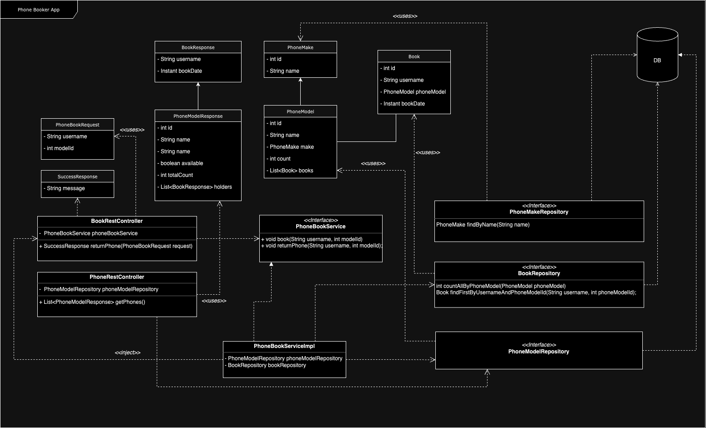

# Phone Booker Application
### Overview
App lets to book and return phones from predefined list of phones.

### Requirements
* Java >= 17
* Maven 3
* docker and docker-compose

### Env variables
Environment variables are defined in .env file. It contains variables for DB. By default, it is using embedded 
H2 database. To use different database change variables to your needs. 

### Run application
Run docker-compose using `docker-compose up`. This will build the application and run at port `8080`

### Build app and container
- App is built using Maven. To build run: `mvn clean package`
- To build container: `docker-compose build`

### Run tests
To run tests: `mvn clean test`. App contains unit and functional tests.

### DesignSpec docs
Overview of the components and REST API spec is in this [pdf](Doc.pdf) file.

### OpenAPI/Swagger docs
Service provides OpenAPI docs you can access at http://localhost:8080/swagger-ui/index.html. You can use it make 
requests to service in the UI.

### UML class diagram

